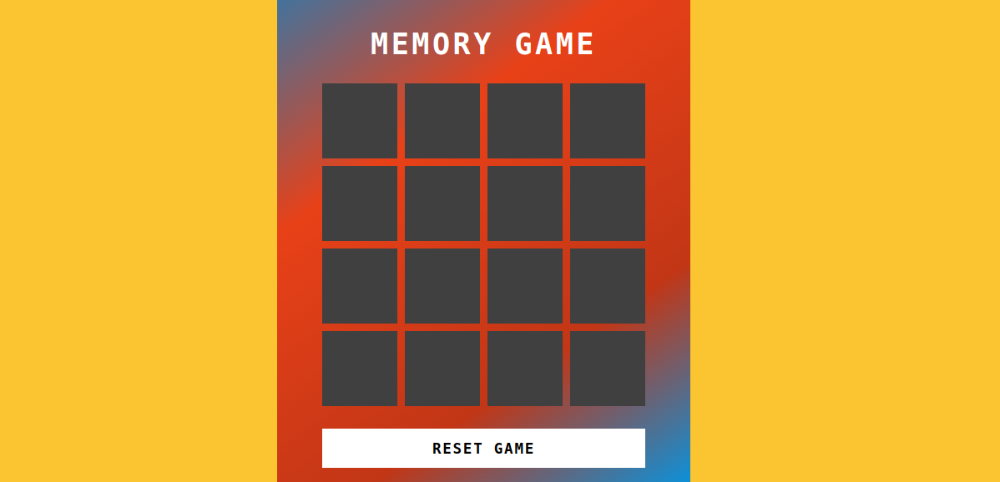

# Memory Game 🎮

##  Memory Game 🚀

## [CLIQUE AQUI](https://viktor-ariel.github.io/Momory-game/) para jogar agora

### ℹ️ Sobre o Jogo 

O jogo estimula a curiosidade e a autoconfiança, proporcionando desenvolvimento da linguagem, do pensamento, da concentração e da atenção. 

Durante a minha participação em um bootcamp de desenvolvimento de jogos criei esse jogo. Agradecemos por fazer parte desta jornada. Deixe um feedback de como melhorar. GRATIDÃO!

### 🛠️ Tecnologia Utilizada 🛠️

Algumas das tecnologias e linguagens que utilizamos incluem:

- Javascript
- CSS
- HTML

### 📞 Contato 💚

Para entrar em contato ou relatar problemas, você pode me encontrar nas seguintes redes sociais ou me enviar um e-mail:

- Email: viktorariel777@gmail.com
- Linkedin: [Viktor Ariel](https://www.linkedin.com/in/viktor-ariel/)

Divirta-se e boa sorte!

